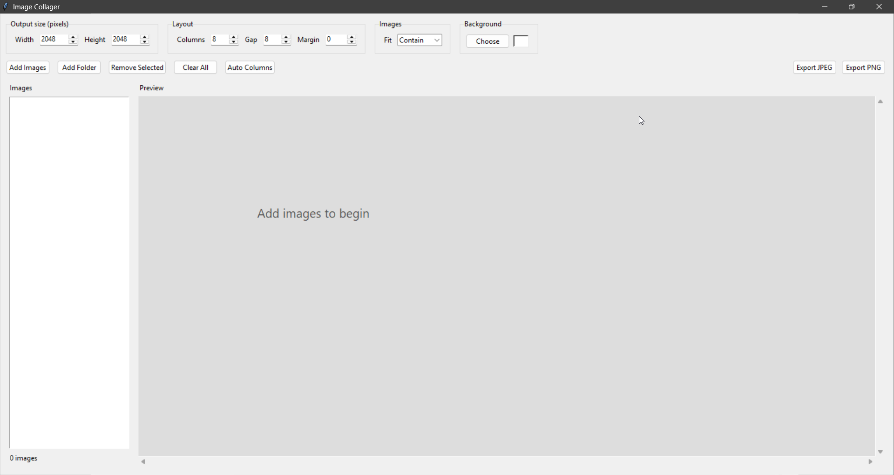

# Image Collager

A lightweight desktop image collage maker for creating **large, precisely sized image grids**.

Image Collager is designed for quickly combining dozens of square or rectangular images into a single canvas. You choose the final canvas dimensions and grid layout, add your images, and export the finished collage at the exact resolution you specified.



## Features

- Create collages at any custom resolution
- Supports **50, 60, 100+ images**
- Add multiple images at once
- Add an entire folder of images
- Automatic grid layout
- Choose the number of columns
- Rows are calculated automatically
- Adjustable image spacing
- Adjustable outer margins
- Custom background color
- Live preview
- PNG export
- JPEG export
- Exact output resolution
- Supports square and rectangular images
- Three image fitting modes:
  - Contain
  - Cover
  - Stretch
- Remove selected images
- Keyboard shortcuts
- Windows executable support

## Example

For a collection of 60 images:

```text
Canvas:    2048 × 2048
Columns:   10
Rows:      6
Gap:       8 px
Margin:    0 px
```

Result:

```text
┌────┬────┬────┬────┬────┬────┬────┬────┬────┬────┐
│ 01 │ 02 │ 03 │ 04 │ 05 │ 06 │ 07 │ 08 │ 09 │ 10 │
├────┼────┼────┼────┼────┼────┼────┼────┼────┼────┤
│ 11 │ 12 │ 13 │ 14 │ 15 │ 16 │ 17 │ 18 │ 19 │ 20 │
├────┼────┼────┼────┼────┼────┼────┼────┼────┼────┤
│ 21 │ 22 │ 23 │ 24 │ 25 │ 26 │ 27 │ 28 │ 29 │ 30 │
├────┼────┼────┼────┼────┼────┼────┼────┼────┼────┤
│ 31 │ 32 │ 33 │ 34 │ 35 │ 36 │ 37 │ 38 │ 39 │ 40 │
├────┼────┼────┼────┼────┼────┼────┼────┼────┼────┤
│ 41 │ 42 │ 43 │ 44 │ 45 │ 46 │ 47 │ 48 │ 49 │ 50 │
├────┼────┼────┼────┼────┼────┼────┼────┼────┼────┤
│ 51 │ 52 │ 53 │ 54 │ 55 │ 56 │ 57 │ 58 │ 59 │ 60 │
└────┴────┴────┴────┴────┴────┴────┴────┴────┴────┘
```

The resulting image is exactly **2048 × 2048 pixels**.

## Installation

### Run from source

Clone the repository:

```bash
git clone https://github.com/YOUR_USERNAME/Image_Collager.git
cd Image_Collager
```

Create a virtual environment using [uv](https://github.com/astral-sh/uv):

```bash
uv venv
```

Activate the environment:

### Windows PowerShell

```powershell
.venv\Scripts\Activate.ps1
```

Install dependencies:

```bash
uv pip install -r requirements.txt
```

Run the application:

```bash
python image_collager.py
```

### Using `uv run`

You can also run the application without activating the environment:

```bash
uv run python image_collager.py
```

## Windows Executable

A standalone Windows executable can be created using PyInstaller.

Install PyInstaller:

```bash
uv add --dev pyinstaller
```

Build:

```bash
uv run pyinstaller --onefile --windowed --name "Image Collager" image_collager.py
```

The executable will be created at:

```text
dist/
└── Image Collager.exe
```

The resulting executable can be run without installing Python or the project's dependencies.

## Usage

### 1. Set the canvas size

Enter the desired output dimensions.

For example:

```text
Width:  4096
Height: 4096
```

The final exported image will be exactly:

```text
4096 × 4096 pixels
```

### 2. Add images

Use **Add Images** to select multiple files.

Alternatively, use **Add Folder** to import all supported images from a folder.

### 3. Choose the number of columns

Set the desired number of columns.

The application automatically calculates the required number of rows based on the number of images.

For example:

```text
60 images
10 columns
```

produces:

```text
10 × 6
```

### 4. Adjust spacing

**Gap**

Controls the space between individual images.

**Margin**

Controls the space between the image grid and the outer canvas.

### 5. Choose image fitting

#### Contain

Keeps the complete image visible inside its grid cell.

No cropping occurs.

#### Cover

Fills the entire grid cell while maintaining the image's aspect ratio.

Some parts of the image may be cropped.

#### Stretch

Resizes the image to exactly fill the grid cell.

This may change the image's aspect ratio.

### 6. Choose a background

Select any background color for the canvas.

This is particularly useful when using **Contain**, because unused space around an image will use the selected background color.

### 7. Export

Export the finished collage as either:

- PNG
- JPEG

The exported image uses the exact canvas dimensions specified in the application.

## Supported Formats

| Format | Supported |
|---|:---:|
| PNG | ✓ |
| JPG | ✓ |
| JPEG | ✓ |
| WEBP | ✓ |
| BMP | ✓ |
| GIF | ✓ |
| TIFF | ✓ |

## Keyboard Shortcuts

| Shortcut | Action |
|---|---|
| `Ctrl + O` | Add images |
| `Ctrl + E` | Export PNG |
| `Delete` | Remove selected images |

## Project Structure

```text
Image_Collager/
│
├── image_collager.py
├── requirements.txt
├── run_collager.bat
├── README.md
├── LICENSE
│
├── screenshots/
│   └── main.png
│
└── dist/
    └── Image Collager.exe
```

## Requirements

### From source

- Python 3.11+
- Tkinter
- Pillow
- uv *(recommended)*

### Standalone EXE

The standalone Windows executable does not require a separate Python installation.

## Tech Stack

- **Python** — application logic
- **Tkinter** — graphical interface
- **Pillow** — image processing
- **PyInstaller** — Windows executable packaging
- **uv** — Python environment and dependency management

## Performance

Image Collager is intended for large image collections and can handle collages containing **dozens or hundreds of images**.

Performance depends on:

- Number of images
- Source image resolution
- Final canvas resolution
- Available system memory

Very large canvases such as `8192 × 8192` or larger can require significant memory during export.

## License

This project is licensed under the MIT License.

## Contributing

Contributions are welcome.

If you find a bug or have a feature request, please open an issue.

Pull requests are also welcome.